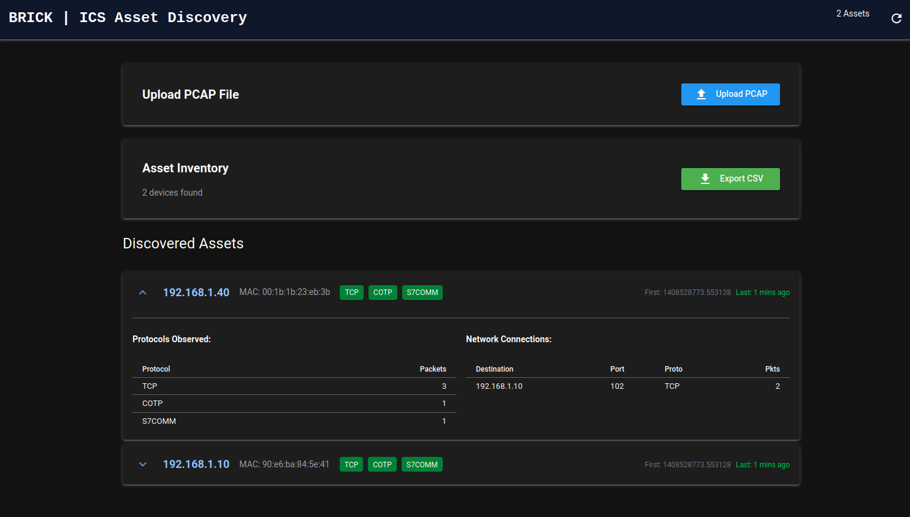

# 🧱 Brick

Brick is a lightweight, open-source ICS asset discovery tool for industrial networks.

Built on Zeek with CISA's ICSNPP plugins, Brick analyzes network captures to 
identify Modbus, EtherNet/IP, and S7comm devices, providing a simple asset 
inventory for compliance and network visibility.

Perfect for smaller facilities that need basic asset discovery without 
enterprise complexity or cost.

[](LICENSE)
[](https://zeek.org/)
[](https://www.python.org/)

---

## Why Brick?

After spending time reviewing existing ICS tooling such as [GRASSMARLIN](https://github.com/nsacyber/GRASSMARLIN) and CISA's [Malcolm](https://github.com/cisagov/Malcolm), I saw a need for a lightweight tool that could be utilzed for ICS asset inventory for budget-constrained organizations. A lot of tools in this space are either overkill for something as simple as an asset inventory or exist as a paid product (usually from the hardware vendor).
There is no special sauce here, this tool is simply glue for the hard work and effort others have put in. 

- **Simple** - Upload PCAP and view results
- **Effective** - Easy to navigate with actionable information upfront
- **Open Source** - Community reviewable and contributor-friendly


---

## Architecture

Brick consists of two main containers:

1. **Zeek Container**: Runs Zeek with ICSNPP plugins for industrial protocol analysis
2. **NiceGUI Container**: Provides the web interface and manages the SQLite database

```
┌─────────────────────────────────────────────────────────┐
│                       Brick System                      │
├─────────────────────────────────────────────────────────┤
│  Web Interface (NiceGUI)          Zeek Analyzer         │
│  ├─ Asset Cards                   ├─ Modbus Parser      │
│  ├─ Connection View               ├─ EtherNet/IP Parser │
│  ├─ PCAP Upload                   ├─ S7comm Parser      │
│  └─ SQLite Database               └─ JSON Logging       │
└─────────────────────────────────────────────────────────┘
```

---

## Quick Start

### Prerequisites

- Podman or Docker
- Podman Compose or Docker Compose
- 2GB+ free RAM
- Linux host (recommended) or macOS/Windows with container support

### Installation

1. **Clone the repository**:
   ```bash
   git clone https://github.com/letsgetweird/brick.git
   cd brick
   ```

2. **Start the containers**:
   ```bash
   podman-compose up -d
   # or
   docker-compose up -d
   # or
   ./reset.sh (just a simple bash script for redeploying with podman)
   ```

3. **Access the web interface**:
   Open your browser to `http://localhost:8080`

4. **Upload a PCAP file** 

---

## Project Structure

```
brick/
├── Dockerfile.zeek          # Zeek container with ICSNPP plugins
├── compose.yaml             # Container orchestration
├── reset.sh                 # Reset script for development
├── app/
│   ├── main.py             # NiceGUI application entry point
│   ├── components.py       # UI components
│   ├── state.py            # Application state management
│   ├── database.py         # SQLite operations
│   ├── log_processor.py    # Zeek log parsing
│   └── upload_handler.py   # PCAP upload handling
├── scripts/
│   └── dangdevil.zeek      # Custom Zeek scripts
├── data/                   # Persistent data directory
└── uploads/                # PCAP upload directory
```

---


### Custom Zeek Scripts

Add custom Zeek scripts to the `scripts/` directory. They will be automatically loaded on container startup.

---

## Usage Examples

### Analyzing a PCAP File

1. Click "Upload PCAP" in the web interface
2. Select your capture file
3. Wait for processing to complete
4. View discovered assets in the dashboard


### Reset Development Environment

```bash
./reset.sh
```

This script stops containers, removes volumes, and cleans up temporary files.

---

## Supported Protocols

Brick currently supports the following industrial protocols via CISA ICSNPP plugins:

| Protocol | Plugin | Common Use Cases |
|----------|--------|------------------|
| **Modbus** | [icsnpp-modbus](https://github.com/letsgetweird/icsnpp-modbus) | PLCs, RTUs, SCADA systems |
| **EtherNet/IP** | [icsnpp-enip](https://github.com/letsgetweird/icsnpp-enip) | Allen-Bradley PLCs, industrial Ethernet |
| **S7comm** | [icsnpp-s7comm](https://github.com/letsgetweird/icsnpp-s7comm) | Siemens PLCs (S7-300, S7-400, S7-1200, S7-1500) |

---


## Roadmap

- [ ] DNP3 protocol support
- [ ] BACnet protocol support
- [ ] Asset fingerprinting and identification
- [ ] Authentication
- [ ] Configurable / Better Time
- [ ] Live Traffic ingestion
- [ ] Integration with external SIEM systems
- [ ] Better utilize information from ICSNPP Parsers (we barely scratched the surface here)

---

## Contributing

Contributions welcome! 

- **Found a bug?** Open an issue
- **Have an idea?** Open an issue to discuss
- **Want to code?** Fork, make changes, open a PR

No formal process yet - just be respectful and we'll figure it out together.

---

## License

This project is licensed under the Apache License 2.0 - see the [LICENSE](LICENSE) file for details.

Key points:
- ✅ Commercial use allowed
- ✅ Modification allowed  
- ✅ Distribution allowed
- ✅ Patent grant included
- ✅ Private use allowed
- ⚠️ Must include copyright notice and license
- ⚠️ Must state changes made to code
- ⚠️ Must include NOTICE file if distributed

---

## Acknowledgments

Built with Zeek, CISA's ICSNPP plugins, and NiceGUI.

---

## Support

- **Issues**: [GitHub Issues](https://github.com/letsgetweird/brick/issues)
- **Discussions**: [GitHub Discussions](https://github.com/letsgetweird/brick/discussions)

---

## Disclaimer

Brick is provided for legitimate security testing and network monitoring purposes only. Users are responsible for ensuring they have appropriate authorization before analyzing network traffic. The authors assume no liability for misuse of this tool.

**This tool is designed for trusted, local networks only.**

- Do not expose the web UI (port 8080) to untrusted networks
- Only process PCAPs from trusted sources
- The tool performs passive analysis and does not interact with live networks

